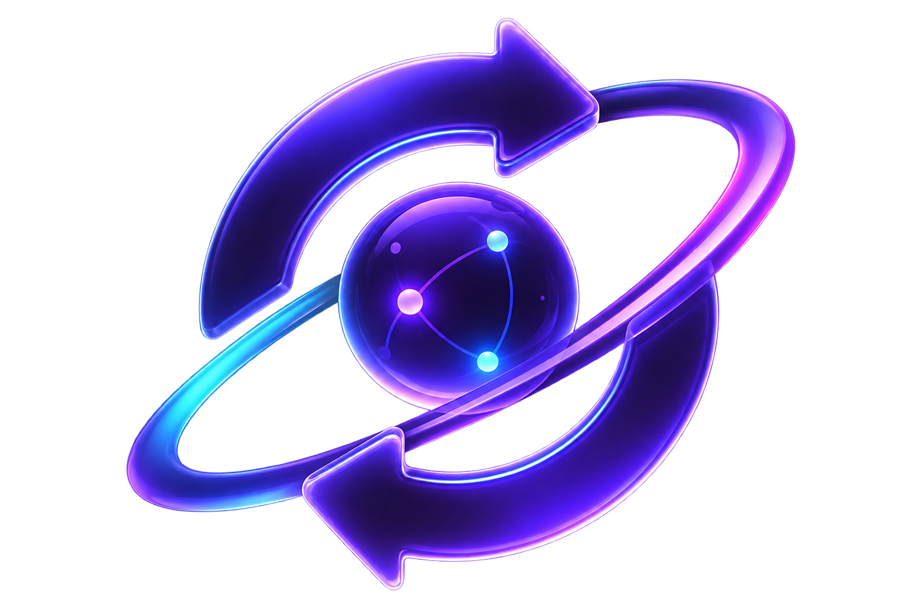
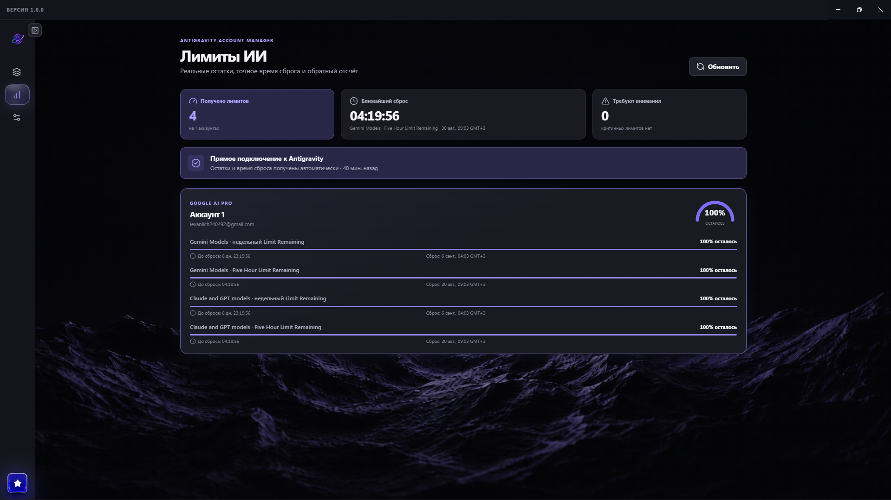
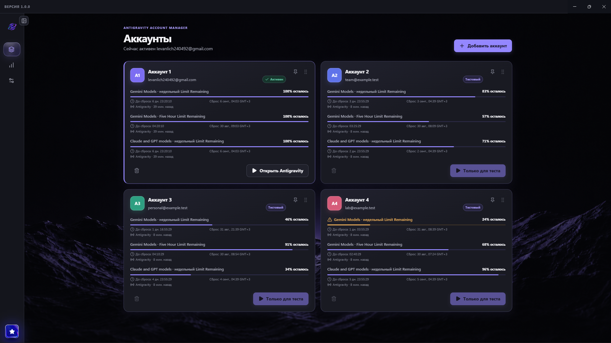
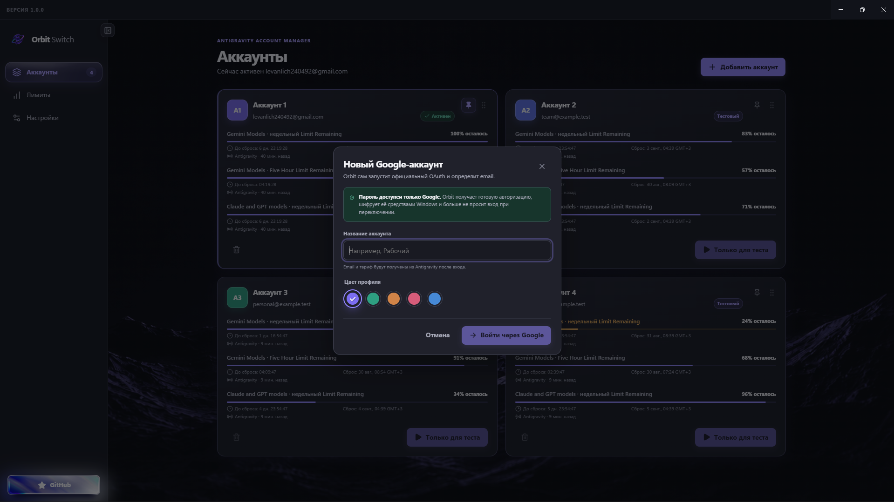
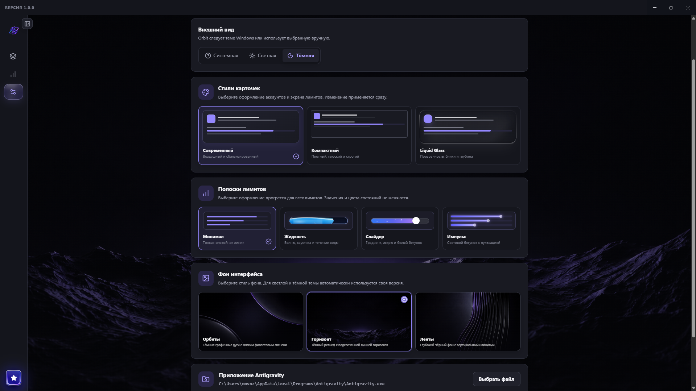

<p align="center">
  
</p>

<h1 align="center">Orbit Switch</h1>

<p align="center">
  Быстрое переключение Google-аккаунтов в Antigravity, наглядные лимиты и аккуратный Windows-интерфейс.
</p>

<p align="center">
  <a href="https://github.com/Chill-Man/Orbit-Switch/releases/latest"></a>
  
  
  
  <a href="LICENSE"></a>
  <a href="https://boosty.to/chillyperchick/donate"></a>
</p>

<p align="center">
  <a href="https://github.com/Chill-Man/Orbit-Switch/releases/latest"><strong>Скачать последнюю версию</strong></a>
  ·
  <a href="#установка">Установка</a>
  ·
  <a href="#безопасность">Безопасность</a>
  ·
  <a href="#сборка-из-исходников">Сборка</a>
</p>



Orbit Switch создан для тех, кто использует несколько Google-аккаунтов в Antigravity и не хочет каждый раз вручную выходить, входить и искать остатки лимитов. Приложение хранит отдельные локальные профили, запускает Antigravity с выбранным аккаунтом и собирает квоты в одном окне.

> Orbit Switch — независимый проект. Он не связан с Google и не является официальной частью Antigravity. Приложение не увеличивает, не обходит и не объединяет лимиты аккаунтов.

## Возможности

- добавление аккаунта через штатный вход Google в браузере — пароль не вводится в Orbit Switch;
- переключение аккаунта и запуск Antigravity одной кнопкой;
- отдельный локальный Chromium-профиль для каждой карточки;
- реальные остатки квот, точное время сброса и ежесекундный обратный отсчёт;
- единый экран лимитов для Gemini, Claude и GPT-моделей, доступных в Antigravity;
- закрепление аккаунтов, перетаскивание карточек и сохранение пользовательского порядка;
- переименование аккаунта двойным щелчком или через контекстное меню;
- светлая, тёмная и системная темы;
- отдельные фоновые изображения для светлой и тёмной темы;
- три оформления карточек и четыре варианта полосок прогресса, включая анимированную воду;
- сворачиваемая и перемещаемая кнопка боковой панели;
- автоматический поиск `Antigravity.exe` и ручной выбор файла, если программа установлена нестандартно;
- локальное хранение настроек без облачного сервера Orbit Switch.

## Установка

1. Откройте [последний релиз](https://github.com/Chill-Man/Orbit-Switch/releases/latest).
2. Выберите подходящий вариант:

   | Файл | Назначение |
   |---|---|
   | `Orbit-Switch-1.0.0-Windows-x64-x86-Setup.exe` | Обычная установка с автоматическим выбором x64/x86, ярлыками и деинсталлятором |
   | `Orbit-Switch-1.0.0-Windows-x64-Portable.exe` | Один x64 EXE: скачайте и запускайте без установки |

3. Если Antigravity не найдена автоматически, укажите путь к `Antigravity.exe` в настройках.

Оба варианта содержат Electron и все библиотеки Orbit Switch. Node.js, npm и дополнительные JavaScript-библиотеки устанавливать не нужно. Portable-версия не создаёт запись в списке установленных программ, но хранит настройки и аккаунты в общей папке `%APPDATA%\orbit-switch`.

### Системные требования

| Компонент | Требование |
|---|---|
| Orbit Switch | Windows 10 или 11, x64 либо x86 |
| Google Antigravity | Установленная официальная версия Antigravity 2.0 |
| Интернет | Нужен для входа Google и обновления лимитов |

Официальная Windows-версия Antigravity 2.0 выпускается только для 64-битных систем. Поэтому сам Orbit Switch запускается на x86 Windows, но переключение аккаунтов потребует доступной для этой системы сборки Antigravity. Актуальные требования Google указаны в [документации Antigravity](https://antigravity.google/docs/getting-started/).

### Предупреждение SmartScreen

Первая публичная сборка может быть без коммерческой цифровой подписи, поэтому Windows SmartScreen способен показать предупреждение о неизвестном издателе. Скачивайте EXE только из раздела Releases этого репозитория и сверяйте SHA-256 с файлом `SHA256SUMS.txt` в релизе.

## Первый аккаунт

1. Нажмите **Добавить аккаунт**.
2. Введите понятное локальное название и выберите цвет карточки.
3. Завершите официальный вход Google в открывшемся окне браузера.
4. Orbit Switch определит email и тариф, зашифрует локальную авторизацию средствами Windows и запустит Antigravity.
5. Добавьте остальные аккаунты тем же способом.

После этого достаточно выбрать карточку и нажать **Переключить**. Перед запуском Orbit Switch завершает текущий процесс Antigravity, восстанавливает зашифрованную авторизацию выбранного аккаунта и открывает его отдельный профиль.

## Интерфейс

<table>
  <tr>
    <td width="50%"></td>
    <td width="50%"></td>
  </tr>
  <tr>
    <td align="center"><strong>Аккаунты</strong><br />Порядок, закрепление, квоты и быстрый запуск</td>
    <td align="center"><strong>Безопасный вход</strong><br />OAuth Google без передачи пароля приложению</td>
  </tr>
  <tr>
    <td width="50%"></td>
    <td width="50%"></td>
  </tr>
  <tr>
    <td align="center"><strong>Лимиты</strong><br />Остаток, время сброса и состояние каждого аккаунта</td>
    <td align="center"><strong>Оформление</strong><br />Темы, карточки, прогресс-бары и фон интерфейса</td>
  </tr>
</table>

Скриншоты сделаны на демонстрационном наборе. Установочная сборка не создаёт тестовые аккаунты — после первого запуска список будет пустым.

## Безопасность

Orbit Switch работает локально и не просит пароль Google.

- авторизация каждого аккаунта шифруется через Electron `safeStorage` с привязкой к текущему пользователю Windows;
- секретные данные исключаются из состояния, передаваемого в интерфейс;
- renderer работает с `contextIsolation`, sandbox и выключенным `nodeIntegration`;
- навигация окна на сторонние страницы блокируется;
- внешние ссылки открываются только по HTTPS в системном браузере;
- при ошибке переключения предыдущая авторизация восстанавливается;
- удаление карточки не стирает каталог профиля безвозвратно.

Локальные данные находятся в `%APPDATA%\orbit-switch`. Не переносите файл состояния между пользователями Windows: зашифрованная авторизация на другом профиле не расшифруется.

### Что приложение намеренно не делает

- не принимает и не сохраняет пароли Google;
- не отправляет аккаунты на сервер разработчика;
- не обращается к приватным quota-endpoint напрямую из renderer;
- не объединяет квоты и не переключает аккаунты автоматически для обхода ограничений;
- не гарантирует совместимость с будущими версиями формата авторизации Antigravity.

Google может менять локальное хранение авторизации и правила использования Antigravity. Перед использованием стороннего менеджера ознакомьтесь с [официальным FAQ Antigravity](https://antigravity.google/docs/faq/).

## Лимиты и обновление данных

Orbit Switch получает доступные квоты через локальные компоненты установленной Antigravity. Для каждого лимита сохраняются:

- название модели или группы моделей;
- оставшийся процент;
- точное серверное время сброса;
- источник и время последнего обновления.

Обновление выполняется последовательно для сохранённых аккаунтов. Если один аккаунт временно недоступен, его последняя успешная квота остаётся на экране, а остальные продолжают обновляться.

## Сборка из исходников

Понадобятся Windows 10/11, Git и Node.js 22 или новее.

```powershell
git clone https://github.com/Chill-Man/Orbit-Switch.git
cd Orbit-Switch
npm install
npm run dev
```

Проверки проекта:

```powershell
npm run lint
npm test
npm run build
```

Универсальный NSIS-установщик для x64 и x86:

```powershell
npm run dist
```

Одиночный Portable EXE для x64:

```powershell
npm run dist:portable
```

Готовые файлы появятся в `release/`. Сборка x86 использует Electron 43 — последнюю основную ветку Electron с готовыми Windows ia32-бинарниками.

## Устройство проекта

```text
src/
├── components/          интерфейс, карточки, навигация и лимиты
├── assets/              логотип и светлые/тёмные фоны
├── lib/                 порядок аккаунтов, расчёты квот и времени
├── test/                компонентные и интеграционные тесты
├── api.ts               типизированный renderer bridge
└── App.tsx              экраны и состояние интерфейса

electron/
├── main.cjs             жизненный цикл приложения и IPC
├── preload.cjs          минимальный безопасный bridge
├── account-store.cjs    локальные аккаунты, настройки и квоты
├── credential-vault.cjs шифрование и переключение авторизации
├── antigravity.cjs      поиск, запуск и остановка Antigravity
└── antigravity-provider.cjs локальное получение аккаунта и лимитов
```

## Поддержать проект

Если Orbit Switch экономит вам время, поддержать разработку и новые версии можно на [Boosty](https://boosty.to/chillyperchick/donate).

Сообщения об ошибках и предложения принимаются в [GitHub Issues](https://github.com/Chill-Man/Orbit-Switch/issues). Перед созданием issue укажите версию Windows, версию Orbit Switch, версию Antigravity и шаги воспроизведения.

## Лицензия

Исходный код распространяется по лицензии [MIT](LICENSE).
